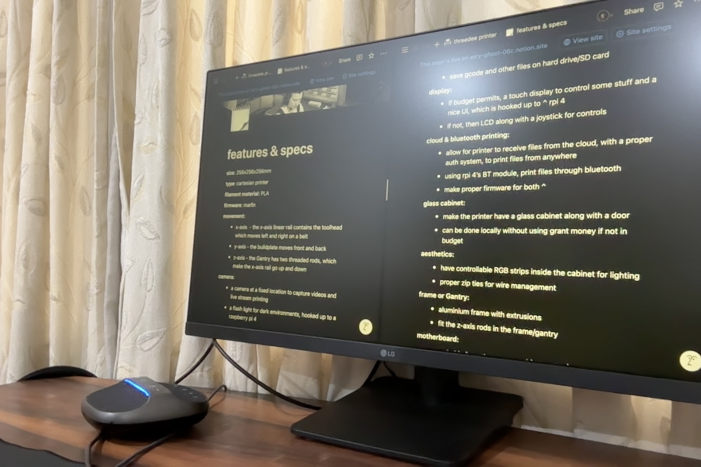
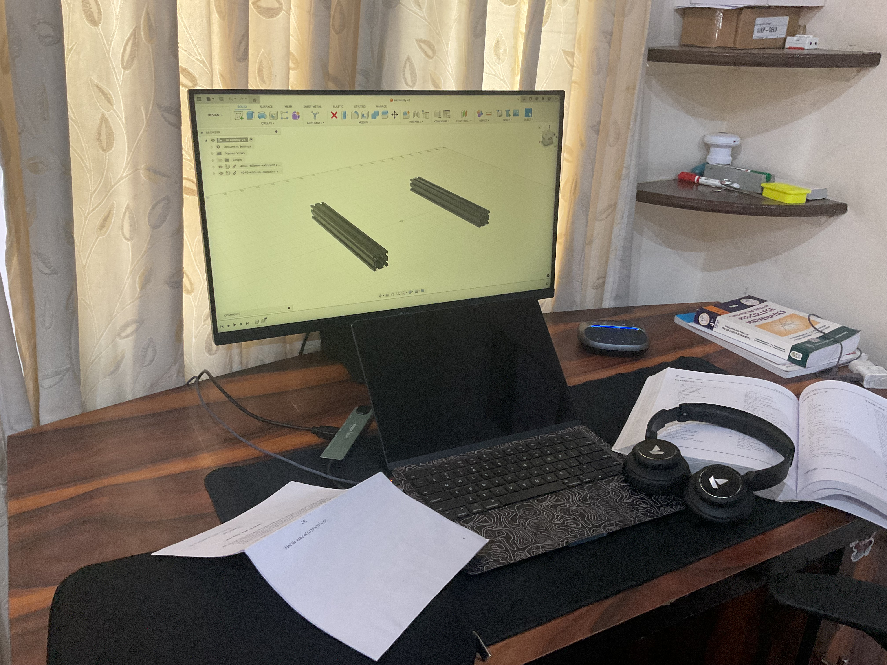
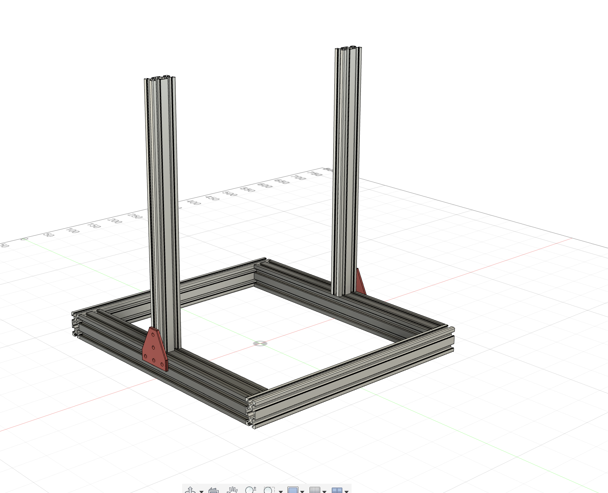
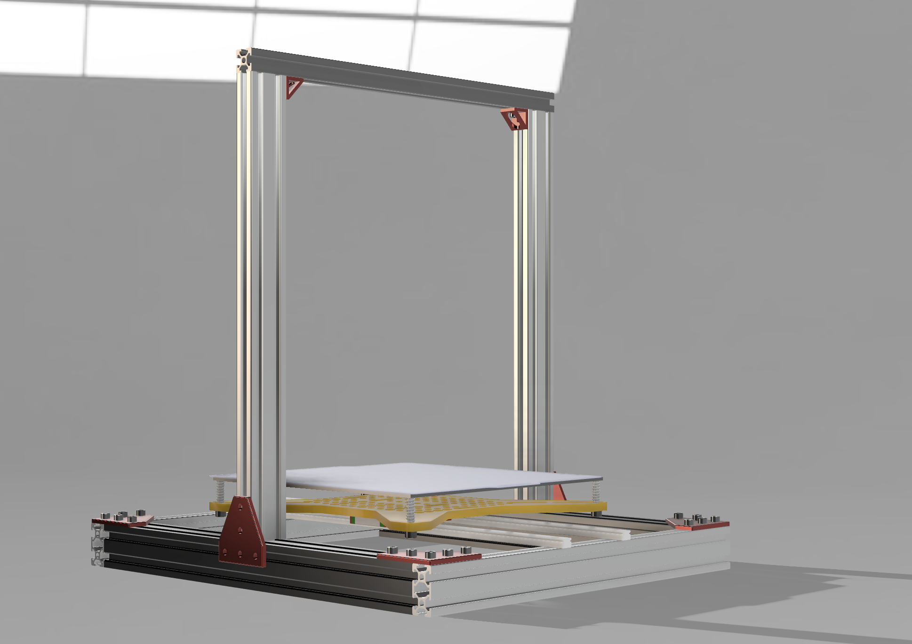
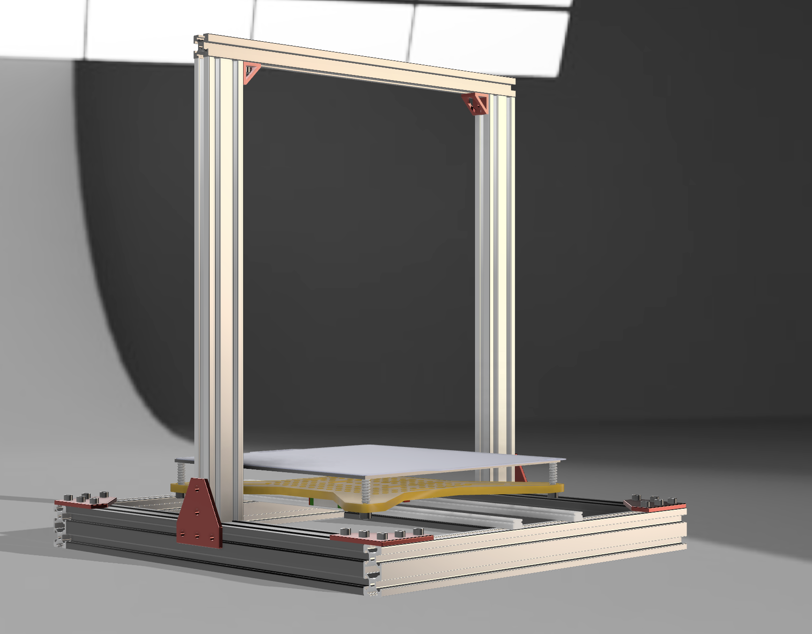
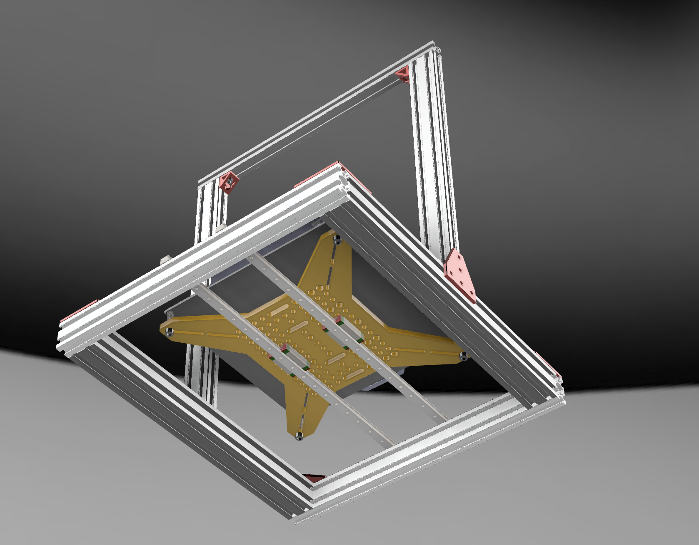
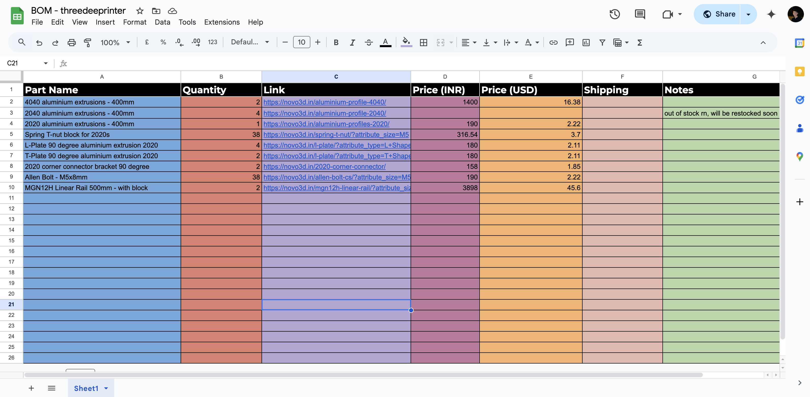
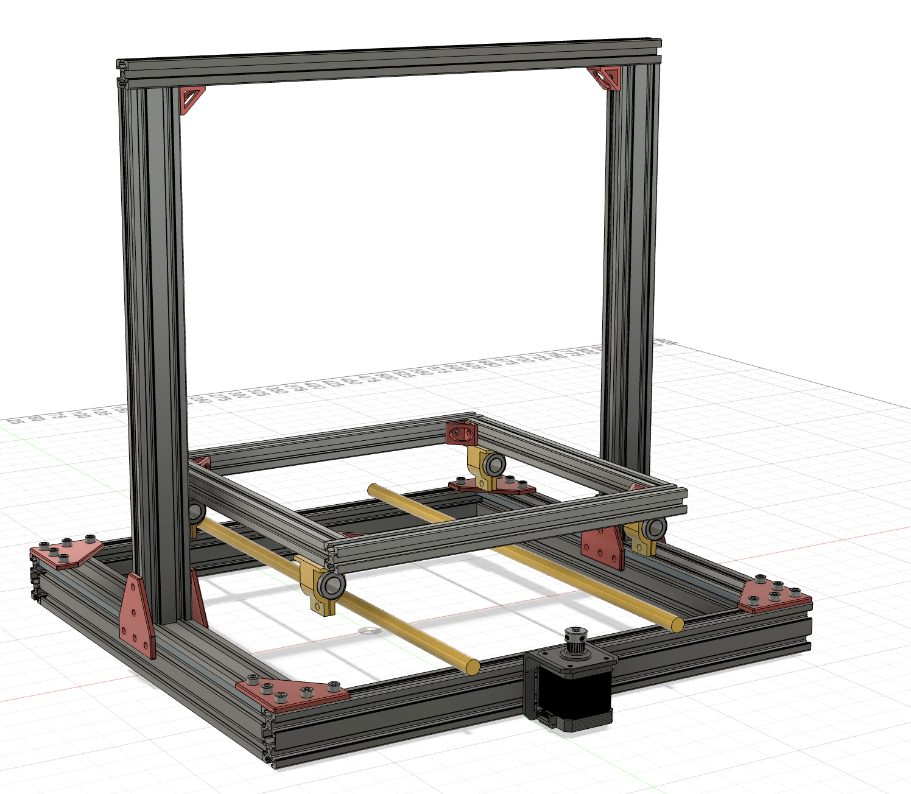

# threedeeprinter - a custom 3D printer

### 28th May (day 1): initial research

i did some talking to people on Slack (@aryan, @souptik, @manan) and learnt quite a bit about how 3D printer work. i checked out some articles and videos on that topic.

I decided on a few basic things:-

- printer material
- kinematics
- build volume
- other VERY cool features

</img>

**Total time spent:** 1.5 hours

### 29th May (day 2): more research and beginning work on Gantry

i checked the [infill](https://infill.hackclub.com) resources and docs, and looked at other very cool printers built by HC members. in the end, I decided to take one of the printers as my inspiration. i read an [instructables](https://www.instructables.com/DIY-3D-Printer-From-Scratch/) article and began my work on the Gantry/frame.

i started with the base 4040 and 2040 extrusions.

</img>

**Total time spent:** 3 hours

### 30th May (day 3): finish frame and almost complete y-axis

i started the day with finishing the the frame. I ended up using a mix of 4040s and 2040s for the base, and 2040s, 2020s for the vertical part. after finishing the frame, I literally had 0 idea how to proceed.

</img>

after a bit of reading, searching and watching, I thought to choose parts for my y-axis first. I ended up choosing the bed assembly, heatbed, build plate etc. I also did a bit of reading on linear rails vs rods for the bedslinger. I went with rails in the end. @Souptik on Slack helped me a lot in understand the working of the bed-slinger and provided some very cool youtube videos.
I finished adding the carriage, heatbed, plate and rails.

</img>
</img>
</img>

**Total time spent:** 7 hours

### 31st May (day 4): making the BOM & change of plans

I though of starting on the BOM today, and I was able to find most of the parts and already utilise 1/3rd of my budget 😭. However, I could not find a perfect sized heat bed on Indian sites. I decided to go with a 310mm x 310mm heatbed. But, my build plate was just 256x256, that would be a waste of heat and power :/
so I ended up changing my build volume to 310㎣.

</img>

**Total time spent:** 2 hours

### 1st June (day 5): - more change of plans & pulley system

I initially thought of using linear rails for the y-axis bed slinger, but my BOM was already so pricy even though I wasn't close to being done. and the fact that rails are so hard to setup for me 😭. I chose rods instead of rails, changed my setup. Removed the original aluminium bed carriage I was buying, and used a square of 2020s instead to make it even cheaper. I installed the stepper motor, did some research on all the parts I had to use, and added the pulleys, belts, mounts, made some custom to be 3D printed mounts. And ended the day with being told that my part is un-printable 😭

</img>

**Total time spent:** 6 hours
