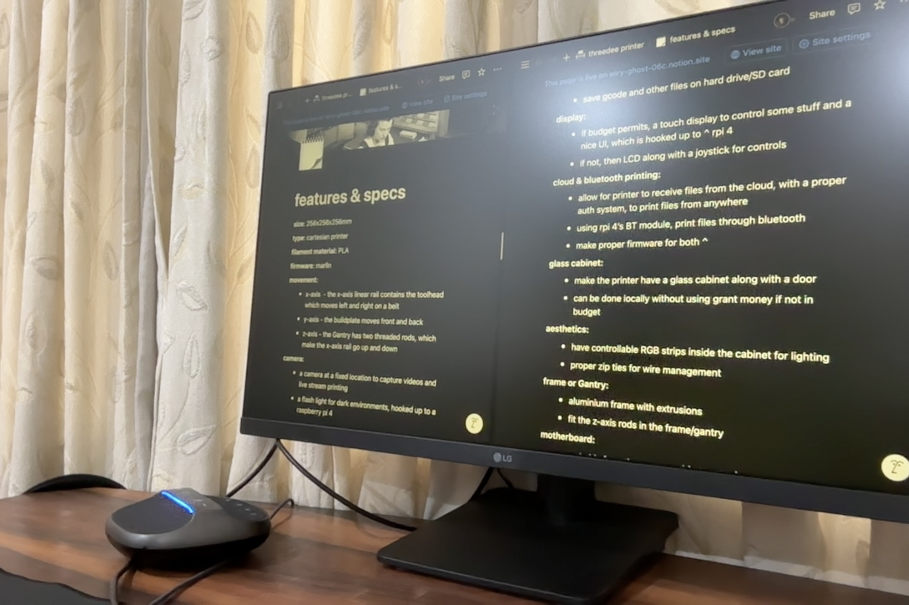

# threedeeprinter - a custom 3D printer

### 28th May (day 1): initial research

i did some talking to people on Slack (@aryan, @souptik, @manan) and learnt quite a bit about how 3D printer work. i checked out some articles and videos on that topic.

I decided on a few basic things:-

- printer material
- kinematics
- build volume
- other VERY cool features

</img>

**Total time spent:** 1.5 hours

### 29th May (day 2): more research
